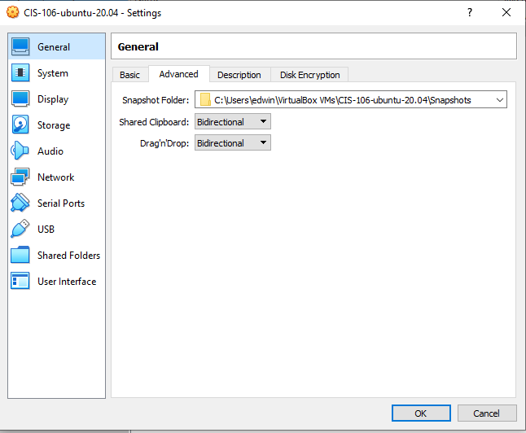
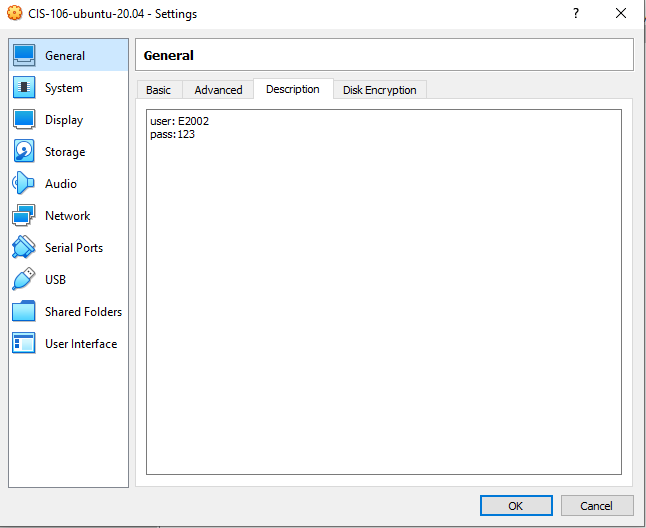
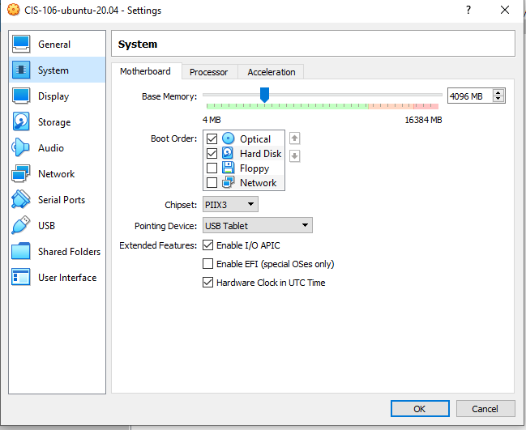
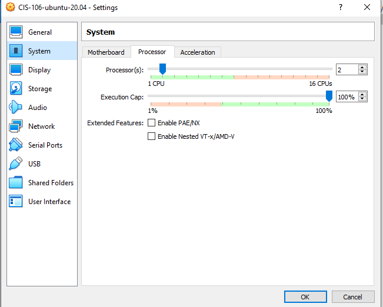
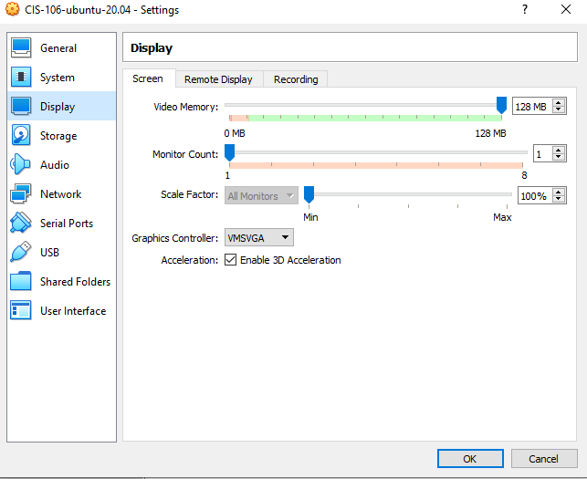
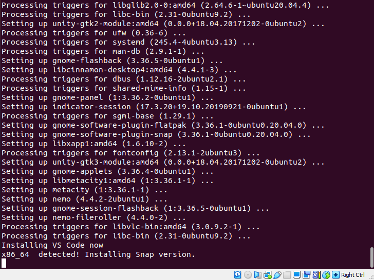
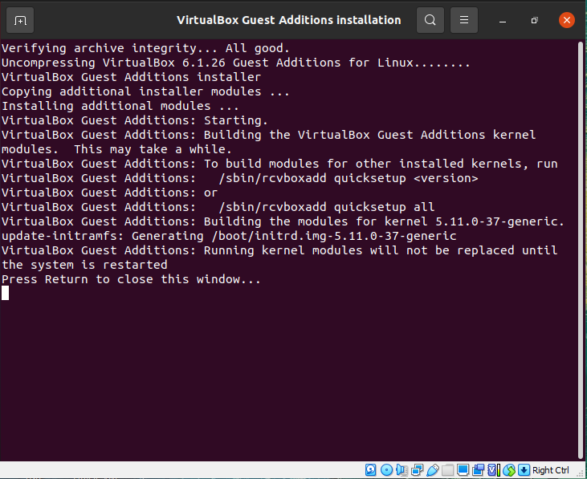
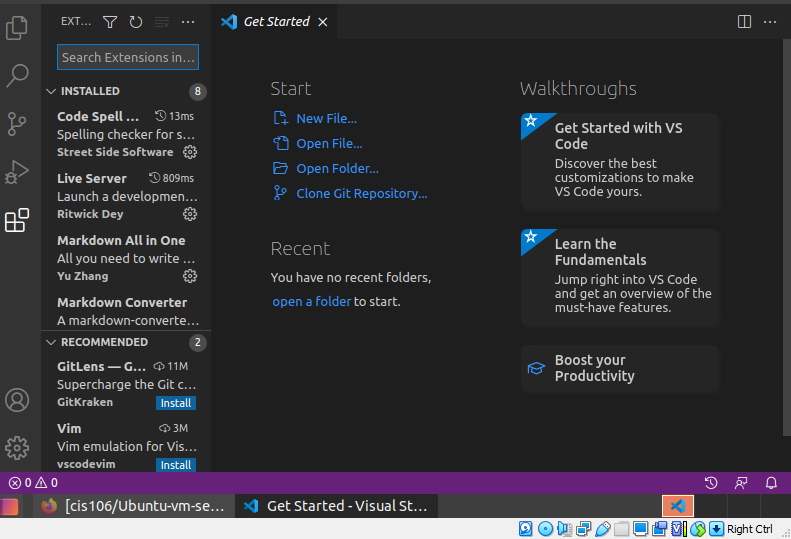

## Question 2 | Create Virtual Machine
Before you can create virtual machines, you need to install VirtualBox and VirtualBox Extension Pack. To download Vbox and the extension pack go to:

## Question 3 |  Install Ubuntu 20.04

## Question 4 | Prepare Ubuntu 20.04 

## Question 5 | Setup VS Code, Git and Github

