#Question 1
##Part 1
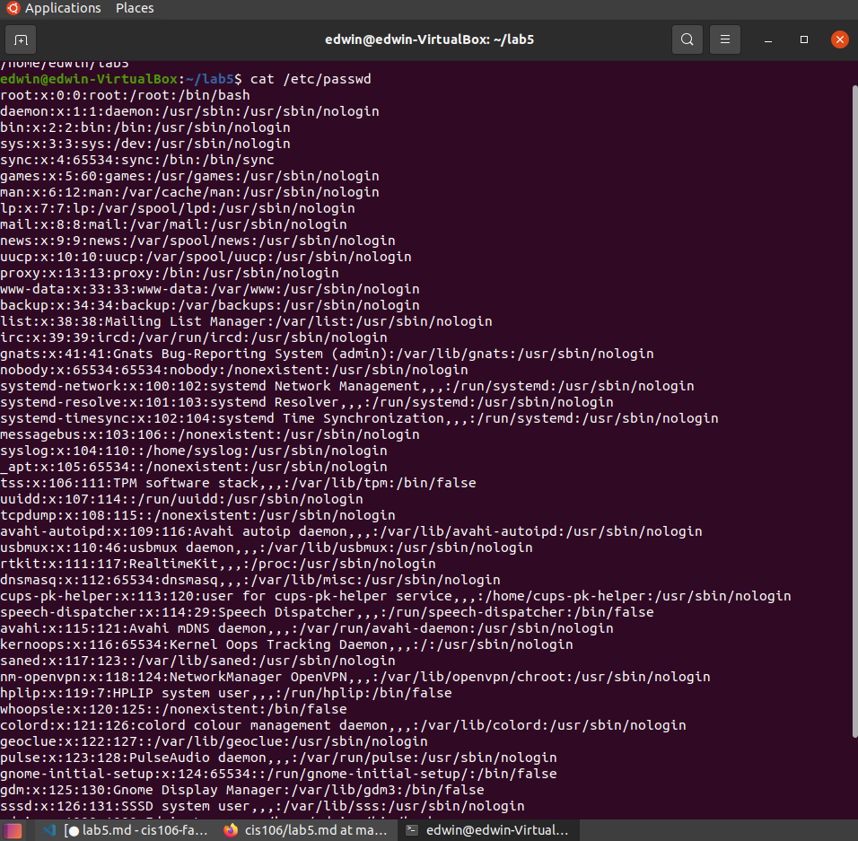
##Part 2
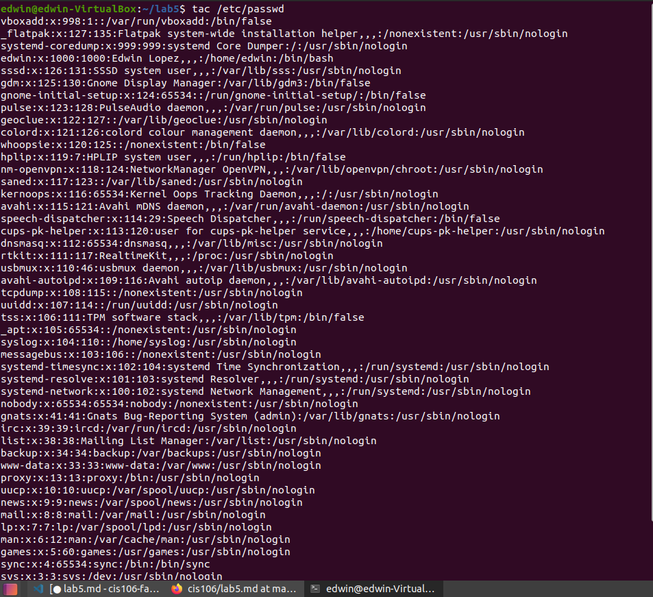
##Part 3
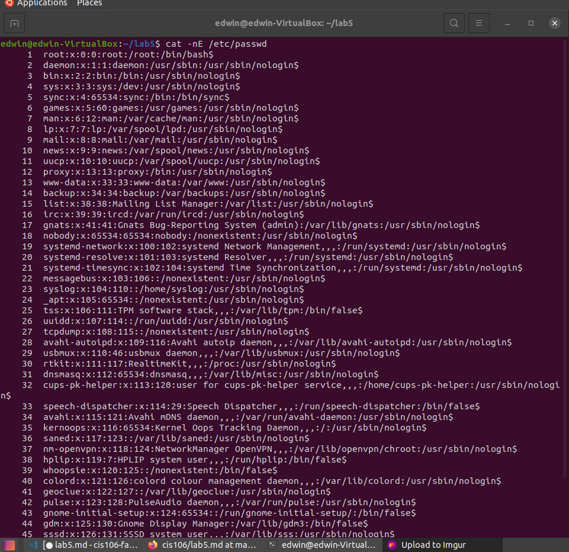
##Part 4
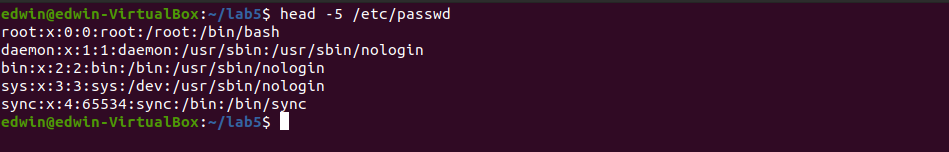
##Part 5
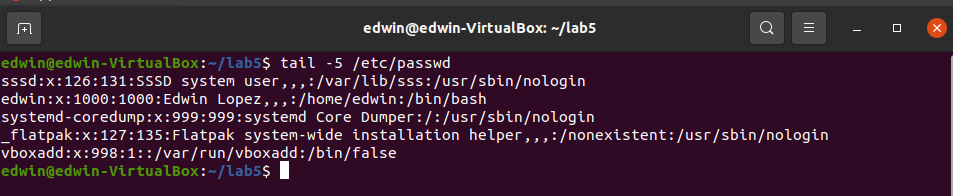
#Question2
##Part 1
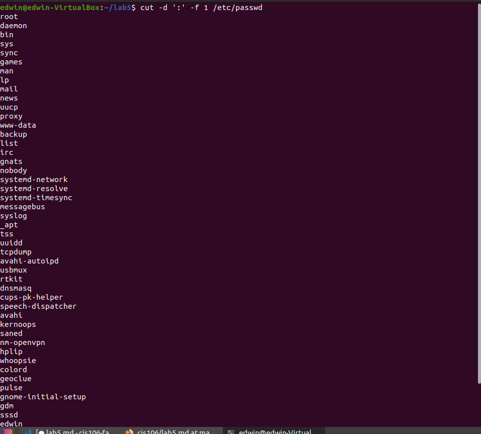
##Part 2
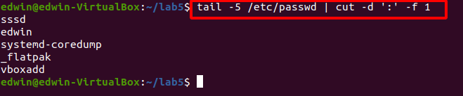
##Part 3
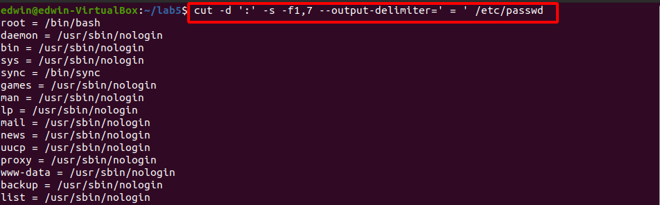
##Part 4
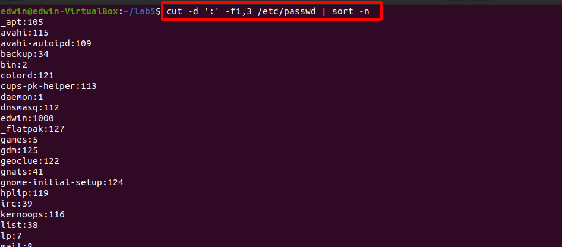
##Part 5
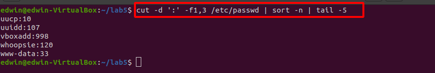
#Question3
##Part 1

##Part 2
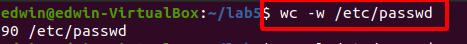
##Part 3
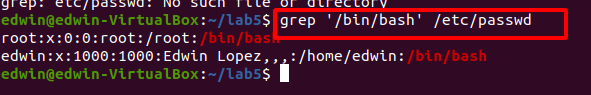
##Part 4
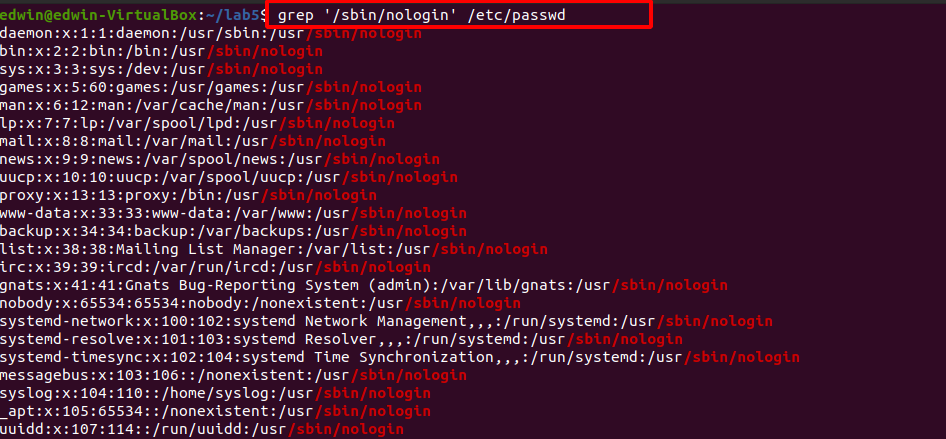
##Part 5
missing
#Question4
##Part 1
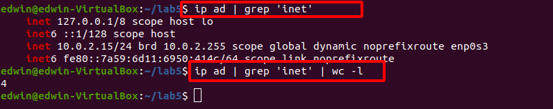
##Part 2
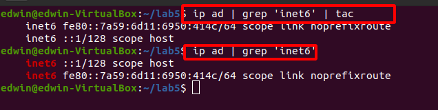
##Part 3
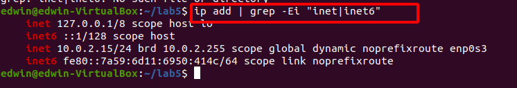
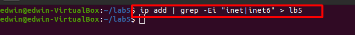
##Part 4
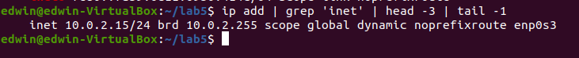
##Part 5
missing
#Question 5
##Part 1-3

##Part 3

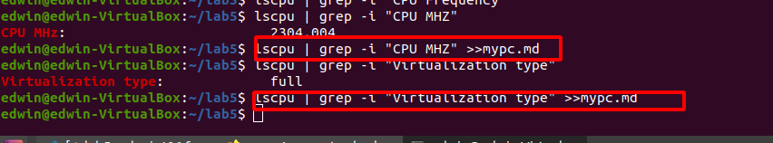
##Part 4

##Part 5
missing
##Part 6
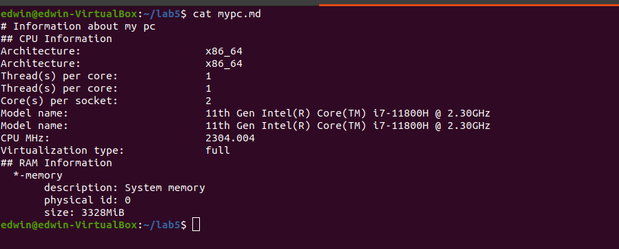