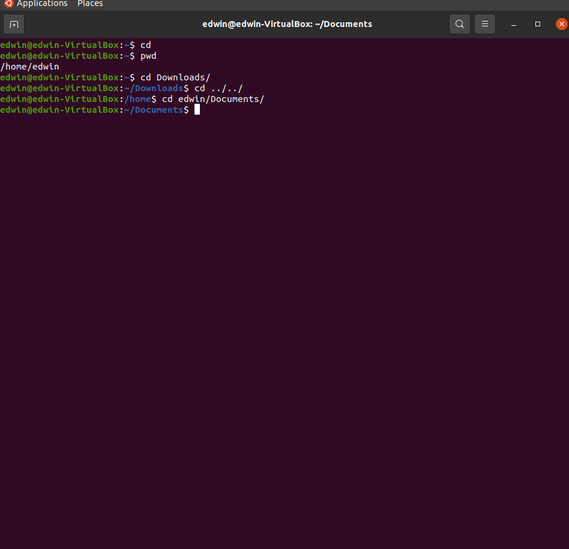
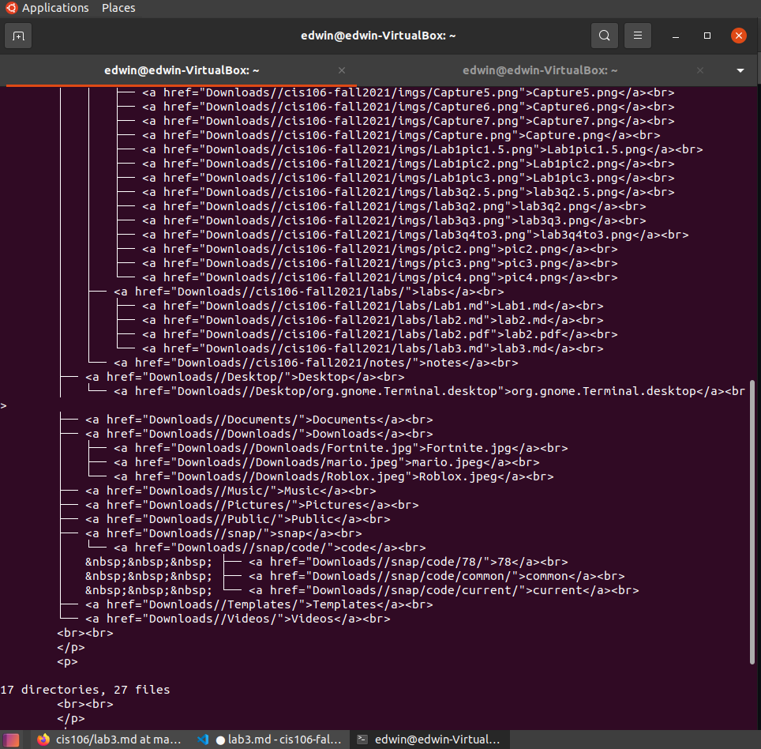

# Lab 3 | Installing software and navigating the file system | Answers
Assignment description [here](https://raw.githubusercontent.com/ra559/cis106/main/labs/lab3.md)

## Question 1
1. Which command did you use to search for the themes and to install them? 
 * apt search theme 
 * sudo apt install yuyo-gtk-theme
2. Which commands did you use to find and install the web browser?  
* sudo apt install  wikipedia2text
  
3.1 What is the name of the package?
* wikipedia2text
  
3.2 What dependencies are needed in order to install the package? (you can either take a screenshot of the terminal or copy and paste from the terminal)
* The following packages were automatically installed and are no longer required:
  apport-symptoms guile-2.2-libs libevent-2.1-7 libgc1c2 libgnome-games-support-1-3
  libgnome-games-support-common libnatpmp1 libqqwing2v5 python3-systemd

3.3 How much disk space will the package utilize after installation?
* Need to get 10.3 kB of archives.
After this operation, 31.7 kB of additional disk space will be used.

4 Use the command line to find a 3D or 2D racing game. Answer the following questions about the game:

4.1 What is the name of the package?
* libclanapp-1.0v5 trophy trophy-data

4.2 What dependencies are needed in order to install the package? (you can either take a screenshot of the terminal or copy and paste from the terminal)
*  libclanapp-1.0v5 trophy-data

4.2 How much disk space will the package utilize after installation?
* Need to get 11.7 MB of archives.
After this operation, 51.7 MB of additional disk space will be used.
 

## Question 2

###question 2.5

## Question 3

## Question 4

## Question 5
